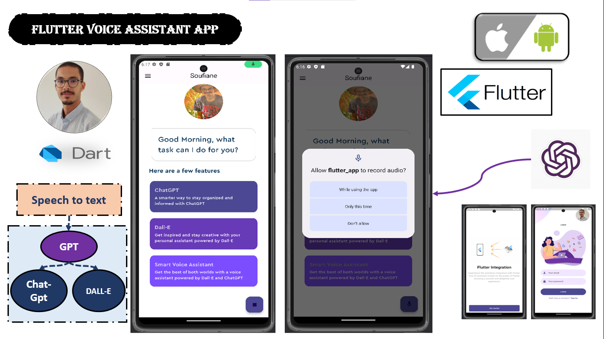
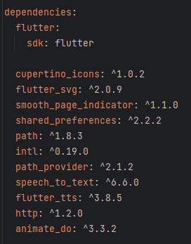
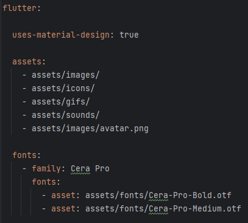
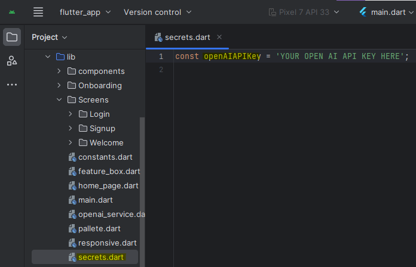

<div align="center">
  
  <h1 style='color:#4c4893' align='center'>
    Flutter Voice Assistant App with ChatGPT & Dall-E AI Image Generation | Machine Learning
  </h1>


  
</div>

<div style="background-color:white; color:black; font-size:15px; font-family:Comic Sans MS; padding:10px; border: 5px solid black;font-weight:bold;border-radius: 20px;">
    In this Project, i tried to build a Personal Virtual Voice Assistant app powered by ChatGPT and DallE API using Flutter. <br><br>
    This sophisticated voice assistant app that can perform various tasks using voice commands. it integrates ChatGPT, a state-of-the-art natural language processing model, and Dall-E, an AI image generation tool, to make your voice assistant even more intelligent and responsive.<br>
  <a href="https://youtu.be/8lqLA1hLC4M"><strong style="color:#4c4893">➥ Demo </strong></a>
</div>


### Dependencies

Before you begin, ensure you have met the following dependencies inside your pubspec.yaml:



then run this command on your terminal to get the dependencies
```bash
flutter pub get
```

### Assets

And dont forget to mention the assets as well inside your pubspec.yaml:




### OPEN AI KEY:

then put your openai key here:



### Run Locally

To run **the flutter app** locally, run this command on your IDE terminal:

```bash
flutter clean
flutter run
```
After runing your emulator of course!!


<div style="background-color:#4c4893; color:white; font-size:15px; font-family:Comic Sans MS; padding:10px; border: 5px solid black;font-weight:bold;border-radius: 20px;text-align:center"> ✨ THE END ✨</div><br>